# AI-Based Phishing Website Detection and Security Alert System

## Overview

The AI-Based Phishing Website Detection and Security Alert System is a web application developed using Java Spring Boot to identify phishing websites and protect users from cyber threats. The system analyzes URLs, detects malicious websites using AI-based techniques, stores detection history, and generates security alerts for administrators.

## Technologies Used

- Java
- Spring Boot
- Spring Security
- REST API
- MySQL
- Maven
- HTML
- CSS
- JavaScript
- Bootstrap

## Features

- User Registration
- User Login
- Admin Login
- Admin Dashboard
- URL Analysis Module
- AI-Based Website Detection
- Website Monitoring
- Security Alert Generation
- Detection History
- User Management
- Report Generation
- Profile Management

## Modules

### User Module
- User Registration
- User Login
- User Dashboard
- URL Analysis
- Website Monitoring
- View Detection Reports
- User Profile

### Admin Module
- Admin Login
- Admin Dashboard
- View Users
- View Security Alerts
- Manage Reports
- System Monitoring

### AI Detection Module
- URL Analysis
- Phishing Detection
- Risk Prediction
- Alert Generation

## Database

MySQL Database

Tables Used:

- Users
- Admins
- URL Analysis
- Security Alerts
- Detection Reports
- Monitoring Logs

# Project Screenshots

## Admin Dashboard

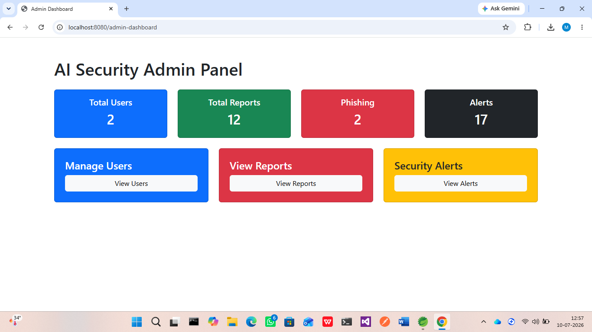

## Admin Login

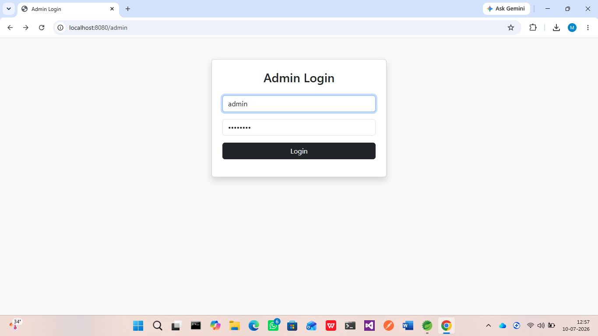

## AI Detection Module

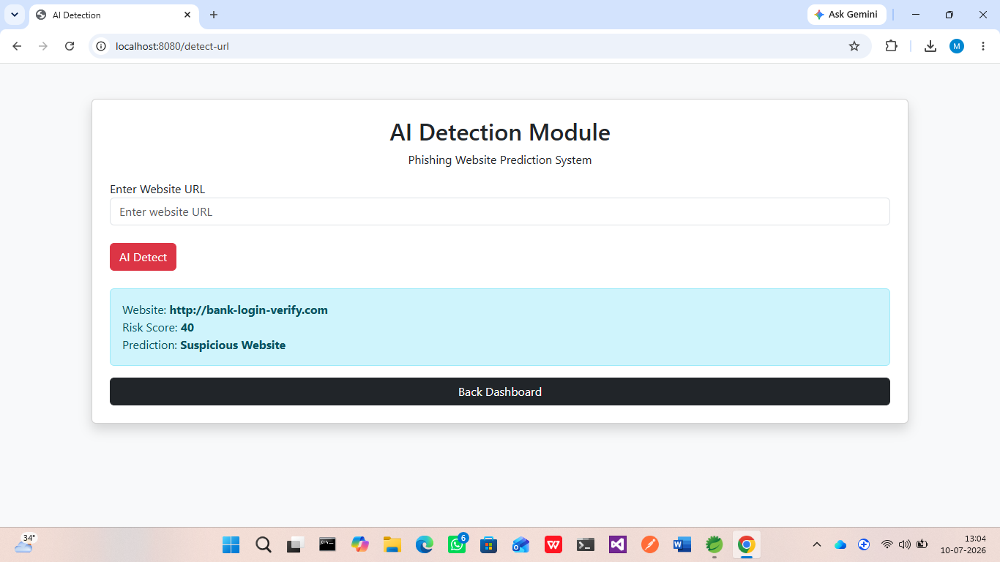

## AI Phishing Reports

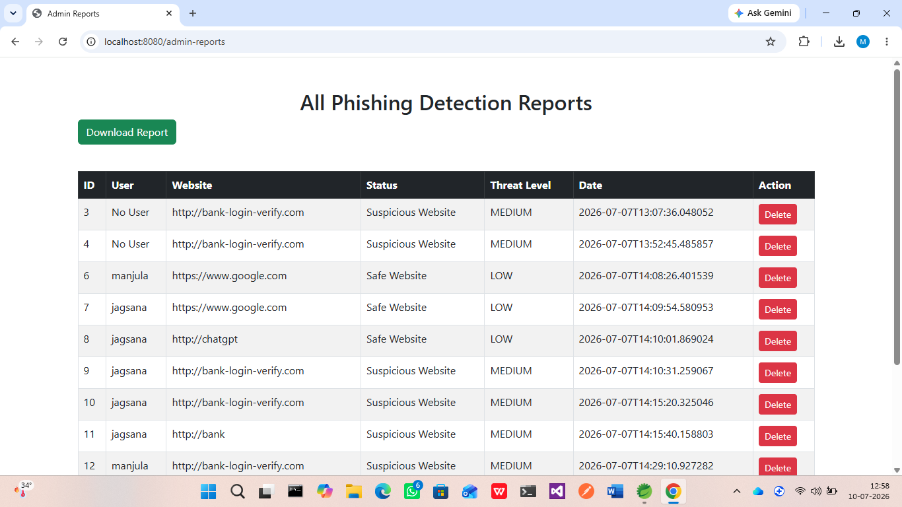

## URL Analysis Module

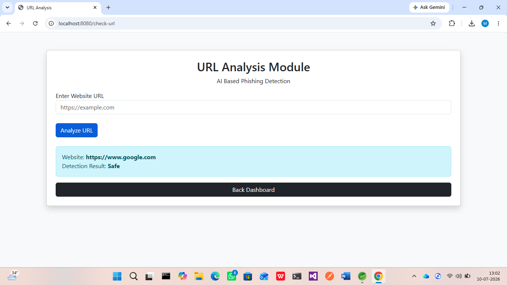

## Security Alert

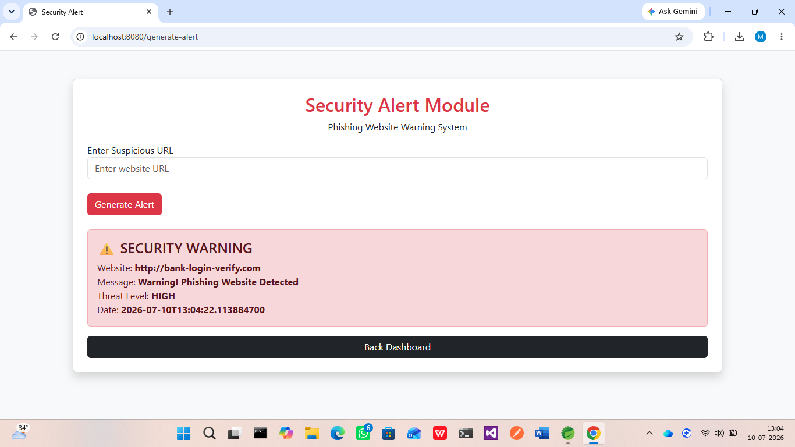

## Website Monitoring

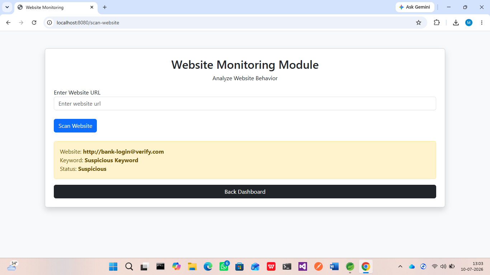

## View Security Alerts

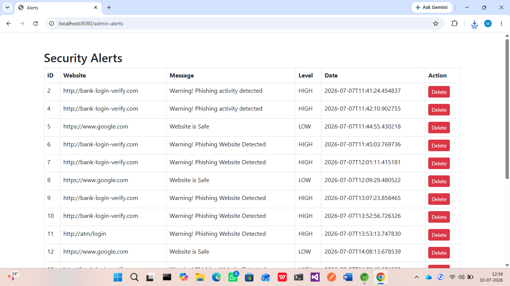

## View Users

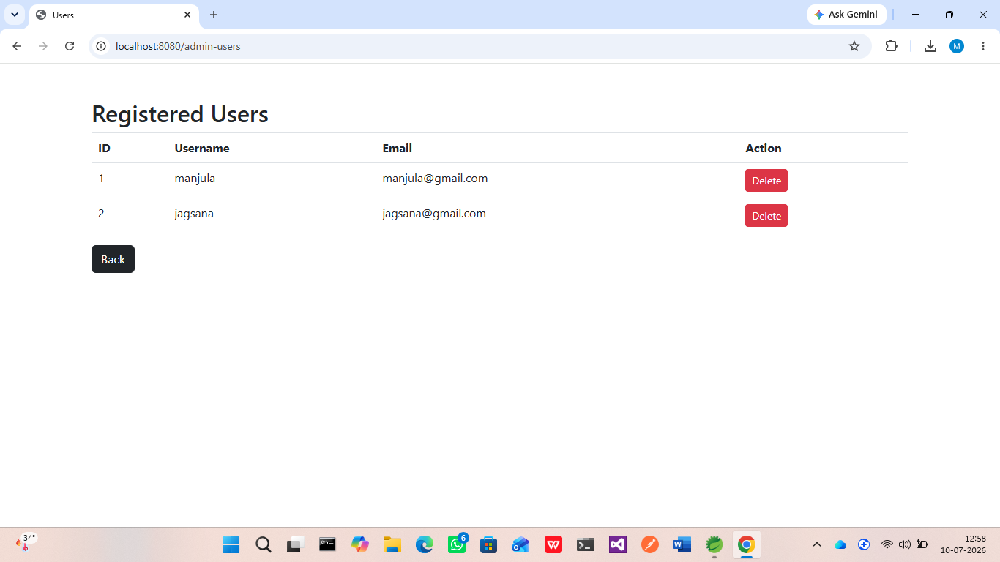

---

## User Dashboard

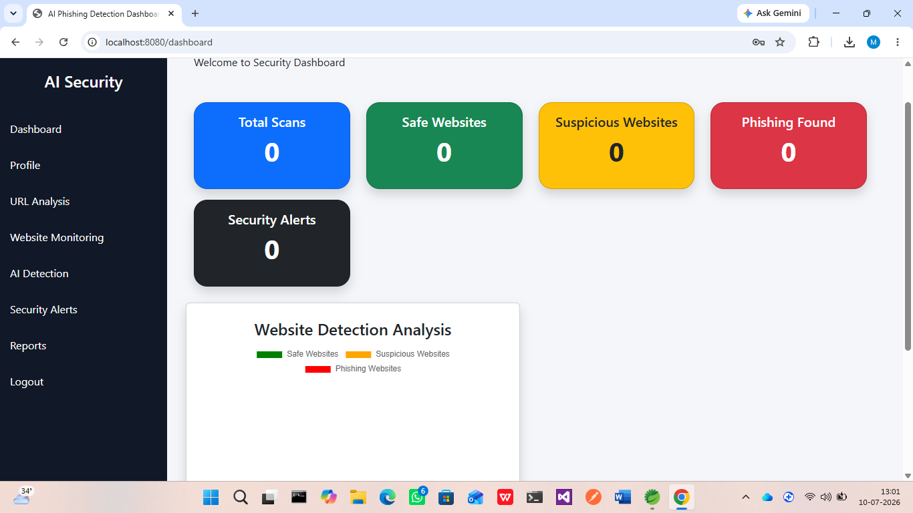

## User Registration

## User Profile

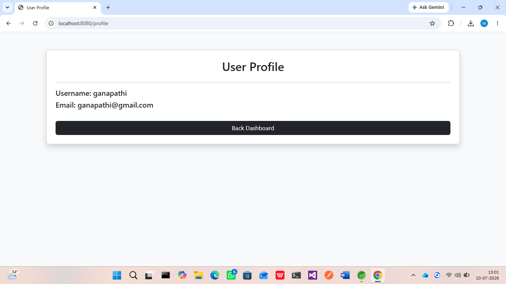

## Phishing Report

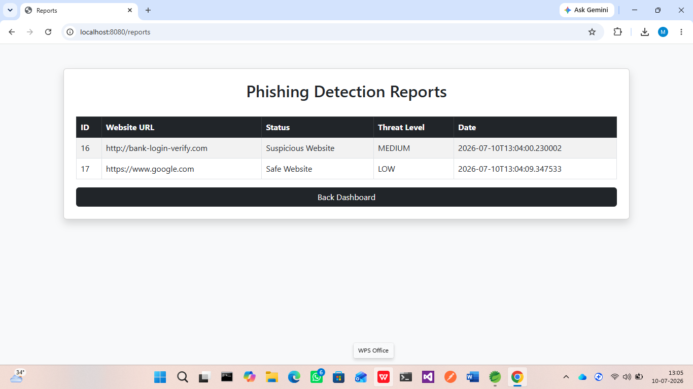

## Excel Report

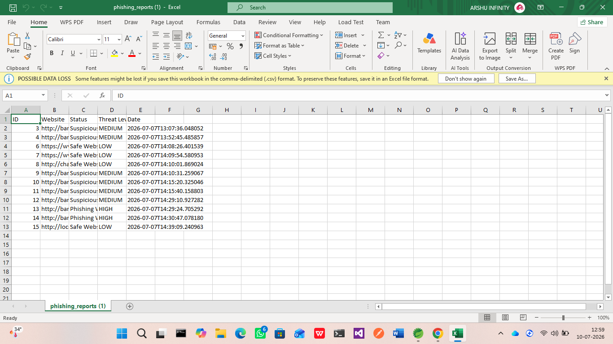

## Future Enhancements

- Machine Learning Model Integration
- Real-time URL Scanning
- Browser Extension
- Email Security Alerts
- Mobile Application
- Cloud Deployment
- Threat Intelligence Integration

## Author

**Manjula A**

Java Developer | Spring Boot Developer | Backend Developer

GitHub:
https://github.com/manjulaarjunan

